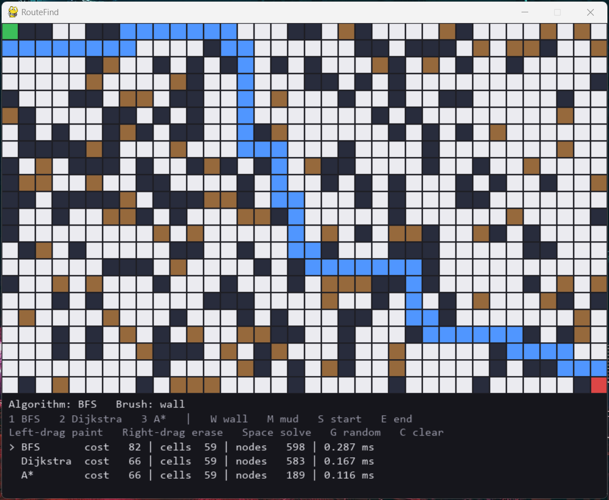

# RouteFind

A pathfinding engine written in C++ with an interactive Python (Pygame) front end. It compares **BFS, Dijkstra and A\*** on weighted grids, and reports nodes expanded, path cost and runtime for each.

The C++ backend does all the algorithmic work and exposes it as a small JSON-over-HTTP service. The Pygame client is only a viewer: it paints the grid, sends it to the backend, and animates whatever comes back.



## Why the three algorithms

| Algorithm | Data structure | Shortest path? | Complexity | Role |
|---|---|---|---|---|
| BFS | queue | Fewest steps only (ignores cell weights) | O(V + E) | Baseline |
| Dijkstra | binary min-heap | Yes, on weighted grids | O((V + E) log V) | Correct with weights |
| A\* | binary min-heap + Manhattan heuristic | Yes, on weighted grids | O((V + E) log V) worst case | Same answer as Dijkstra, fewer nodes |

Movement is 4-directional, so Manhattan distance never overestimates the remaining cost. That makes it an admissible heuristic, which is what keeps A\* optimal.

## Results

Measured by `bench/benchmark.cpp`: 100 random solvable grids per row, start at the top-left and goal at the bottom-right, built with `-O2`. Each algorithm's time is the fastest of 3 runs per grid, averaged over the 100 grids. The random seed is fixed, so node counts and path costs are reproducible; times depend on the machine.

**Grids with obstacles** (25% walls, 10% mud costing 5x):

| Size | Nodes: BFS / Dijkstra / A\* | Time ms: BFS / Dijkstra / A\* | A\* nodes vs Dijkstra | BFS path cost vs optimal |
|---|---|---|---|---|
| 50x50 | 1856 / 1851 / 894 | 0.570 / 0.725 / 0.377 | 51.7% fewer | +37.7% |
| 100x100 | 7444 / 7439 / 3425 | 2.131 / 2.808 / 1.377 | 54.0% fewer | +42.1% |
| 200x200 | 29782 / 29778 / 12951 | 8.629 / 11.427 / 5.368 | 56.5% fewer | +44.2% |

**Empty grids:**

| Size | Nodes: BFS / Dijkstra / A\* | Time ms: BFS / Dijkstra / A\* | A\* nodes vs Dijkstra |
|---|---|---|---|
| 50x50 | 2500 / 2500 / 779 | 0.898 / 1.098 / 0.332 | 68.8% fewer |
| 100x100 | 10000 / 10000 / 4122 | 2.992 / 3.637 / 1.719 | 58.8% fewer |
| 200x200 | 40000 / 40000 / 4754 | 11.498 / 14.611 / 1.781 | 88.1% fewer |

What the numbers show:

- **A\* and Dijkstra always agree on the optimal cost.** The benchmark aborts if they ever differ. A\* just reaches it while expanding roughly half as many nodes on obstacle grids, which is about half the runtime at 200x200.
- **BFS ignores weights, so its paths cost 38-44% more** on grids with mud, even though it finds a route with a similar number of cells.
- **On unweighted grids BFS and Dijkstra expand the same nodes**, but Dijkstra is slower because every heap push and pop costs O(log n).
- The empty-grid savings for A\* vary a lot (59% to 88%) because many equal-cost paths exist, so the result depends on how ties are broken. The obstacle-grid rows are the more representative ones.

## Architecture

```
Pygame client (Python)  --- POST /solve (JSON) --->  C++ server (cpp-httplib)
  paints grid, animates  <-- path + metrics (JSON) --  Grid / BFS / Dijkstra / A* / MinHeap
```

```
RouteFind/
  backend/
    include/    Grid.h, MinHeap.h, BFS.h, Dijkstra.h, AStar.h, Timer.h,
                httplib.h, json.hpp   (third-party single-header libraries, MIT licensed)
    src/        matching .cpp files and main.cpp (the HTTP server)
    tests/      one test program per component
    bench/      benchmark.cpp
  frontend/
    api_client.py   talks to the backend, turns failures into clear errors
    grid_model.py   grid data and start/end points (no drawing code)
    grid_view.py    drawing and mouse-to-cell conversion
    grid_tools.py   random obstacles, path cost
    main.py         the app
    tests/          headless tests
```

### Design decisions

- **Flat `std::vector<int>` grid** with `row * cols + col` indexing instead of a vector of vectors: contiguous memory, one allocation.
- **Hand-written binary min-heap** instead of `std::priority_queue`. Stored as an array with index arithmetic for parent and children.
- **Lazy deletion in Dijkstra and A\***: when a cheaper route to a cell is found, a new heap entry is pushed and stale entries are skipped when popped. Simpler than a decrease-key operation.
- **Timing lives outside the algorithms.** A separate `Timer` wraps each `solve()` call, so the algorithm classes only find paths. It uses `steady_clock`, because `high_resolution_clock` on MinGW is a coarse system clock and made fast solves report 0 ms.
- **Stateless `solve()`**: each algorithm is a static function that takes a grid and returns a `PathResult`, so all three are interchangeable.
- **Defensive Grid**: out-of-range access throws instead of reading invalid memory. The server validates the request and answers malformed input with a 400 and a JSON error.
- Each HTTP request builds its own `Grid`, so request handlers share no mutable state.

## API

`POST /solve` (default port 8081)

```json
{
  "rows": 3, "cols": 5,
  "grid": [1,5,5,1,1, 1,5,5,1,1, 1,1,1,1,1],
  "start": [0, 0], "end": [2, 4],
  "algorithm": "astar"
}
```

Cell values: `-1` wall, `1` normal, any value above 1 is a weighted cell (cost to enter). `algorithm` is `bfs`, `dijkstra` or `astar`.

```json
{ "found": true, "path": [[0,0],[1,0],[2,0],[2,1],[2,2],[2,3],[2,4]],
  "nodesExpanded": 7, "timeMs": 0.012 }
```

## Build and run

You need a C++17 compiler (developed with GCC 13.2 from WinLibs on Windows; older toolchains such as GCC 6 are too old for cpp-httplib) and Python 3 with `pygame` and `requests`.

**Backend** (Windows, MinGW-w64), from `backend/`:

```
g++ -std=c++17 -O2 -D_WIN32_WINNT=0x0A00 -I include src/main.cpp src/Grid.cpp src/BFS.cpp src/Dijkstra.cpp src/AStar.cpp src/MinHeap.cpp -o routefind_server.exe -lws2_32 -lwsock32
./routefind_server.exe
```

On Linux, drop the two Winsock flags and `-D_WIN32_WINNT` and add `-lpthread`.

**Frontend**, from `frontend/`:

```
pip install pygame requests
python main.py
```

**Controls**: left-drag paints with the current brush, right-drag erases. `W` wall, `M` mud, `S` set start, `E` set end. `1` BFS, `2` Dijkstra, `3` A\*. `Space` solves, `G` fills the grid with random obstacles, `C` clears, `Esc` quits. Solve with each algorithm on the same grid to compare them in the panel below the grid.

## Tests

C++ (from `backend/`, for example the A\* test):

```
g++ -std=c++17 -Wall -Wextra -I include tests/test_astar.cpp src/AStar.cpp src/Dijkstra.cpp src/BFS.cpp src/Grid.cpp src/MinHeap.cpp -o tests/test_astar.exe
./tests/test_astar.exe
```

There is one test program each for Grid, MinHeap, BFS, Dijkstra, A\* and Timer, plus `test_timer_resolution.cpp`. They include cross-checks such as Dijkstra against BFS on unweighted grids, A\* against Dijkstra on weighted ones, and a 1000-element heap check against `std::sort`.

Python (from `frontend/`): `python tests/test_grid_model.py`, `test_grid_view.py` and `test_grid_tools.py` need no server. `test_api_client.py` needs the backend running.

Benchmark (from `backend/`):

```
g++ -std=c++17 -O2 -I include bench/benchmark.cpp src/Grid.cpp src/BFS.cpp src/Dijkstra.cpp src/AStar.cpp src/MinHeap.cpp -o bench/benchmark.exe
./bench/benchmark.exe
```

## Limitations and possible extensions

- Movement is 4-directional. Adding diagonals would require switching the heuristic to octile or Chebyshev distance to stay admissible.
- Jump Point Search would cut A\*'s node count further on open grids.
- The benchmark runs the algorithms in-process on a single machine; the times in the tables are from one Windows laptop and will differ elsewhere.
- Lazy deletion lets the heap hold stale entries; a decrease-key heap would avoid that at the cost of extra bookkeeping.